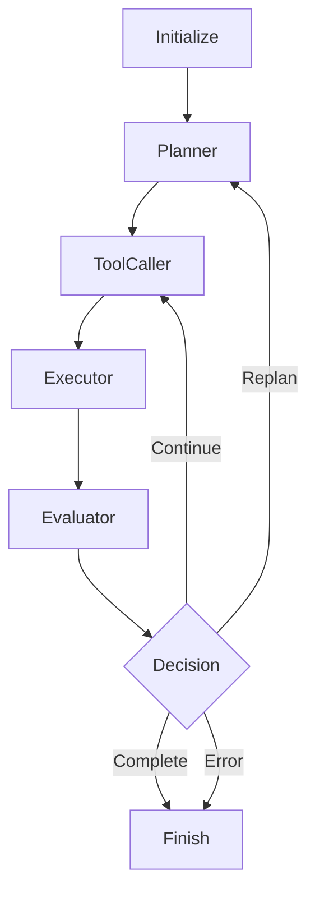

# 🤖 Autonomous Agent with LangGraph

A fully autonomous agent built with LangGraph that can reason, plan, and execute tasks using multiple LLM providers and MCP (Model Context Protocol) tools.

## ✨ Features

### 🧠 Multi-LLM Support
- **Google Gemini** (gemini-pro)
- **OpenAI GPT** (GPT-4, GPT-3.5)
- **Anthropic Claude** (Claude 3 family)
- Dynamic LLM selection with automatic fallback

### 🔧 Tool Integration
- Automatic tool discovery from MCP servers
- REST API and Server-Sent Events (SSE) support
- Input validation and error handling
- Tool result caching and management

### 🌐 Web Interface
- Modern, responsive chat UI
- Real-time updates via Server-Sent Events
- LLM provider selection
- Tool execution visualization
- Session management

### 🔄 LangGraph Workflow
- **Initialize**: Session setup and tool discovery
- **Planner**: Goal analysis and execution planning
- **ToolCaller**: Tool selection and execution
- **Executor**: Result processing and state management
- **Evaluator**: Progress assessment and decision making
- **Finish**: Final response generation

## 🚀 Quick Start

### Prerequisites
- Python 3.10+
- API keys for at least one LLM provider
- MCP server (optional, for tool functionality)

### Installation

1. **Clone the repository**
```bash
git clone <repository-url>
cd book-langraph-agent
```

2. **Install dependencies**
```bash
pip install -r requirements.txt
```

3. **Configure environment**
```bash
cp .env.example .env
# Edit .env with your API keys
```

4. **Run the agent**

**Using Startup Scripts (Recommended):**
```bash
# Unix/Linux/macOS
./start.sh                    # Start web interface (default)
./start.sh --mode cli         # Start CLI interface
./start.sh --check-only       # Check configuration only

# Windows
start.bat                     # Start web interface (default)
start.bat --mode cli          # Start CLI interface
start.bat --check-only        # Check configuration only

# Cross-platform Python script
python start.py               # Start web interface (default)
python start.py --mode cli    # Start CLI interface
python start.py --check-only  # Check configuration only
```

**Manual Startup:**

**Web Interface:**
```bash
python web/app.py
```
Then open http://localhost:5000 in your browser.

**Command Line:**
```bash
python -m agent.main "Summarize the latest AI news"
```

**Interactive Mode:**
```bash
python -m agent.main --interactive
```

## ⚙️ Configuration

### Environment Variables

Create a `.env` file in the project root:

```env
# API Keys for LLM providers
GEMINI_API_KEY=your_gemini_api_key_here
OPENAI_API_KEY=your_openai_api_key_here
ANTHROPIC_API_KEY=your_anthropic_api_key_here

# MCP Server Configuration
MCP_SERVER_BASE_URL=http://localhost:8000

# Default LLM Provider
DEFAULT_LLM_PROVIDER=gemini

# Web App Configuration
FLASK_ENV=development
FLASK_DEBUG=True
FLASK_HOST=0.0.0.0
FLASK_PORT=5000

# Agent Configuration
MAX_ITERATIONS=10
TOOL_TIMEOUT=30
```

### API Key Setup

#### Google Gemini
1. Go to [Google AI Studio](https://makersuite.google.com/app/apikey)
2. Create a new API key
3. Add to `.env`: `GEMINI_API_KEY=your_key_here`

#### OpenAI
1. Go to [OpenAI API Keys](https://platform.openai.com/api-keys)
2. Create a new secret key
3. Add to `.env`: `OPENAI_API_KEY=your_key_here`

#### Anthropic Claude
1. Go to [Anthropic Console](https://console.anthropic.com/)
2. Create a new API key
3. Add to `.env`: `ANTHROPIC_API_KEY=your_key_here`

## 🚀 Startup Scripts

The project includes convenient startup scripts that automatically handle process cleanup and application startup:

### Features
- **Process Management**: Automatically kills existing processes on the configured port
- **Cross-Platform**: Works on Windows, macOS, and Linux
- **Dependency Checking**: Validates Python installation and required packages
- **Environment Validation**: Checks for .env file and configuration
- **Multiple Modes**: Supports both web interface and CLI modes
- **Flexible Options**: Skip process killing, check-only mode, custom ports

### Available Scripts

| Script | Platform | Description |
|--------|----------|-------------|
| `start.sh` | Unix/Linux/macOS | Shell script with full functionality |
| `start.bat` | Windows | Batch script for Windows systems |
| `start.py` | Cross-platform | Python script that works everywhere |

### Usage Examples

```bash
# Basic usage (starts web interface)
./start.sh                    # Unix/Linux/macOS
start.bat                     # Windows
python start.py               # Cross-platform

# Start CLI interface
./start.sh --mode cli
start.bat --mode cli
python start.py --mode cli

# Check configuration without starting
./start.sh --check-only
start.bat --check-only
python start.py --check-only

# Skip killing existing processes
./start.sh --no-kill
start.bat --no-kill
python start.py --no-kill

# Use custom port for process cleanup
./start.sh --port 8080
start.bat --port 8080
python start.py --port 8080

# Show help
./start.sh --help
start.bat --help
python start.py --help
```

### What the Scripts Do

1. **Dependency Check**: Verify Python and required packages are installed
2. **Environment Check**: Ensure .env file exists with configuration
3. **Process Cleanup**: Kill any existing processes on the configured port (default: 5000)
4. **Python Process Cleanup**: Kill any Python processes related to this application
5. **Application Startup**: Start the web interface or CLI based on the selected mode

## 🖥️ Usage

### Web Interface

Start the web server:
```bash
python web/app.py
```

Features:
- **Chat Interface**: Natural language interaction
- **LLM Selection**: Choose between available providers
- **Real-time Updates**: See agent progress in real-time
- **Tool Visualization**: View tool executions and results
- **Session Management**: Clear chat, view configuration

### Command Line Interface

**Basic Usage:**
```bash
python -m agent.main "Your task here"
```

**With specific LLM:**
```bash
python -m agent.main "Analyze this data" --llm openai
```

**Streaming mode:**
```bash
python -m agent.main "Complex task" --streaming
```

**Interactive mode:**
```bash
python -m agent.main --interactive
```

**Check configuration:**
```bash
python -m agent.main --config
```

### Programmatic Usage

```python
import asyncio
from agent.agent_graph import agent
from agent.state import LLMProvider

async def main():
    result = await agent.run(
        user_goal="Summarize recent AI developments",
        selected_llm=LLMProvider.GEMINI
    )

    print(f"Final response: {result.final_response}")
    print(f"Tools used: {len(result.tool_calls)}")
    print(f"Iterations: {result.iteration_count}")

asyncio.run(main())
```

## 🔧 MCP Server Integration

The agent automatically discovers and uses tools from MCP servers.

### Expected Tool Format

Tools should be available at `{MCP_SERVER_BASE_URL}/tools` and return:

```json
{
  "tools": [
    {
      "name": "search_web",
      "description": "Search the web for information",
      "endpoint": "/tools/search",
      "input_schema": {
        "type": "object",
        "properties": {
          "query": {"type": "string"},
          "limit": {"type": "integer"}
        },
        "required": ["query"]
      }
    }
  ]
}
```

### Tool Execution

Tools are called via POST requests to their endpoints with JSON payloads:

```bash
POST {MCP_SERVER_BASE_URL}/tools/search
Content-Type: application/json

{
  "query": "latest AI news",
  "limit": 5
}
```

## 🏗️ Architecture

### Project Structure

```
.
├── agent/
│   ├── main.py              # Entry point and CLI
│   ├── agent_graph.py       # LangGraph state machine
│   ├── planner.py           # Planning and decision logic
│   ├── tools.py             # MCP tool integration
│   ├── llm_router.py        # Multi-LLM support
│   ├── state.py             # Agent state management
│   └── config.py            # Configuration management
├── web/
│   ├── app.py               # Flask web application
│   └── templates/
│       └── chat.html        # Chat interface
├── requirements.txt         # Dependencies
├── .env                     # Environment configuration
└── README.md               # This file
```

### State Machine Flow



### Key Components

#### AgentState
Pydantic model managing:
- User goals and messages
- LLM selection and conversation history
- Tool metadata and execution results
- Planning steps and progress tracking
- Error handling and session management

#### LLMRouter
Unified interface for multiple LLM providers:
- Provider availability checking
- Automatic fallback mechanisms
- Consistent message formatting
- Error handling and retry logic

#### ToolExecutor
MCP tool integration:
- Automatic tool discovery
- Input validation against schemas
- HTTP and SSE execution support
- Result caching and error handling

#### AgentPlanner
Planning and decision-making:
- Goal analysis and decomposition
- Tool selection and sequencing
- Progress evaluation
- Final response generation

## 🔍 API Reference

### Web API Endpoints

#### `GET /`
Main chat interface

#### `GET /api/config`
Get configuration and status information

#### `POST /api/chat`
Send a message to the agent
```json
{
  "session_id": "uuid",
  "message": "Your task",
  "llm_provider": "gemini"
}
```

#### `GET /api/session/{session_id}`
Get session information and status

#### `GET /api/session/{session_id}/stream`
Server-Sent Events stream for real-time updates

#### `POST /api/session/{session_id}/clear`
Clear session messages

#### `GET /api/tools`
Get available tools from MCP server

## 🧪 Testing

Run tests:
```bash
pytest
```

Run with coverage:
```bash
pytest --cov=agent
```

## 🐛 Troubleshooting

### Common Issues

**No LLM providers available:**
- Check API keys in `.env` file
- Verify API key validity
- Check network connectivity

**Tool discovery fails:**
- Verify MCP server is running
- Check `MCP_SERVER_BASE_URL` configuration
- Ensure tools endpoint returns valid JSON

**Web interface not loading:**
- Check Flask configuration
- Verify port availability
- Check browser console for errors

**Agent execution hangs:**
- Check `MAX_ITERATIONS` setting
- Verify tool endpoints are responsive
- Check for circular dependencies in planning

### Debug Mode

Enable debug logging:
```bash
export FLASK_DEBUG=True
python web/app.py
```

Check configuration:
```bash
python -m agent.main --config
```

## 🤝 Contributing

1. Fork the repository
2. Create a feature branch
3. Make your changes
4. Add tests if applicable
5. Submit a pull request

### Development Setup

```bash
# Install development dependencies
pip install -r requirements.txt

# Format code
black agent/ web/

# Lint code
flake8 agent/ web/

# Run tests
pytest
```

## 📄 License

This project is licensed under the MIT License - see the LICENSE file for details.

## 🙏 Acknowledgments

- [LangGraph](https://github.com/langchain-ai/langgraph) for the state machine framework
- [OpenAI](https://openai.com/), [Google](https://ai.google.dev/), and [Anthropic](https://www.anthropic.com/) for LLM APIs
- [Flask](https://flask.palletsprojects.com/) for the web framework
- [Pydantic](https://pydantic.dev/) for data validation

## 📞 Support

For questions, issues, or contributions:
- Open an issue on GitHub
- Check the troubleshooting section
- Review the API documentation

---

**Built with ❤️ using LangGraph and modern AI technologies**
